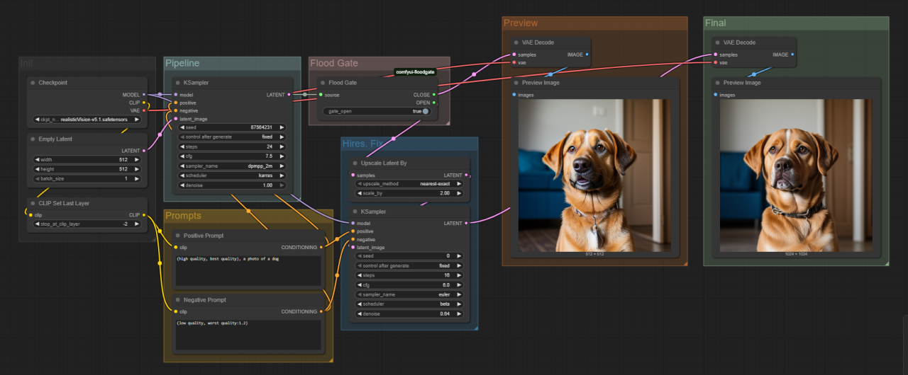

# ComfyUI Floodgate
This is an Extension for [ComfyUI](https://github.com/comfyanonymous/ComfyUI), which allows you to easily control the logic flow!

## New Features
1. You can now connect any arbitrary types 
    - *(input/output types still have to match)*
2. You can now have multiple Floodgates in one workflow
3. Control each Floodgate individually on itself

<h3 align="center">Motivation</h3>

While **Hires. Fix** *(or similar workflows)* can significantly improve the output,
it also takes a longer time to process. Thus, many will simply run the base resolution until a good seed is found before enabling it. 
However, for `ComfyUI` this means connecting and disconnecting multiple nodes every single time...

<h3 align="center">Solution</h3>

Introducing, **Floodgate**!  
Simply toggle between the logic flows. No more reconnecting multiple nodes!

<h3 align="center">How to Use</h3>

Connect the output of a node *(**eg.** `LATENT`)* to the `source` of the Floodgate node, 
then connect each path to the desired remaining workflow. Simply click on `gate_open` to toggle between the paths to take.
The path not chosen will not be executed. Furthermore, since `ComfyUI` caches the intermediate results, 
opening the Floodgate will not require the precedent nodes to be processed again!
