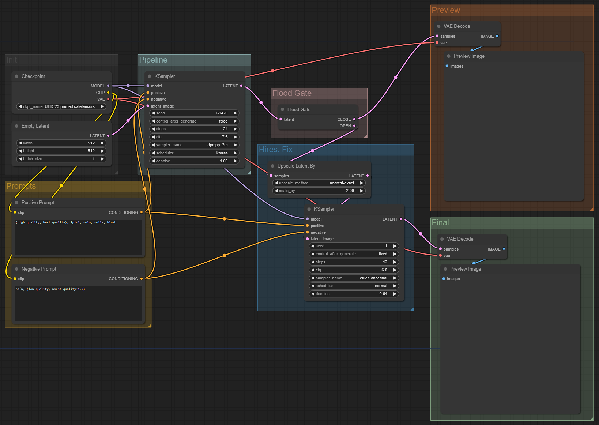

# ComfyUI Floodgate
This is an Extension for [ComfyUI](https://github.com/comfyanonymous/ComfyUI), which allows you to control the logic flow with just one click!

### Motivation
While **Hires. Fix** *(or similar workflows)* can significantly improve the output,
it also takes a longer time to process. Thus, many will simply run the base resolution until a good seed is found before enabling it. 
However, for `ComfyUI` this means connecting and disconnecting multiple nodes every single time...

### Solution
Introducing, **Floodgate**!  
Simply click one button to toggle between the logic flows. No more connecting and disconnecting multiple nodes!

### How to Use
Connect the `LATENT` output from a Sampler node to the input of the Floodgate, 
then connect each path to the desired remaining workflow. Under `Queue Prompt`, you can toggle between the path to take.
The path not chosen will simply not be executed. Also, since `ComfyUI` caches the intermediate data, 
opening the Floodgate will not require the precedent nodes to be processed again!

### Note / ToDo
- Only **one** Floodgate can exist in a Workflow *as of now*
- Only supports `LATENT` connections *as of now*
